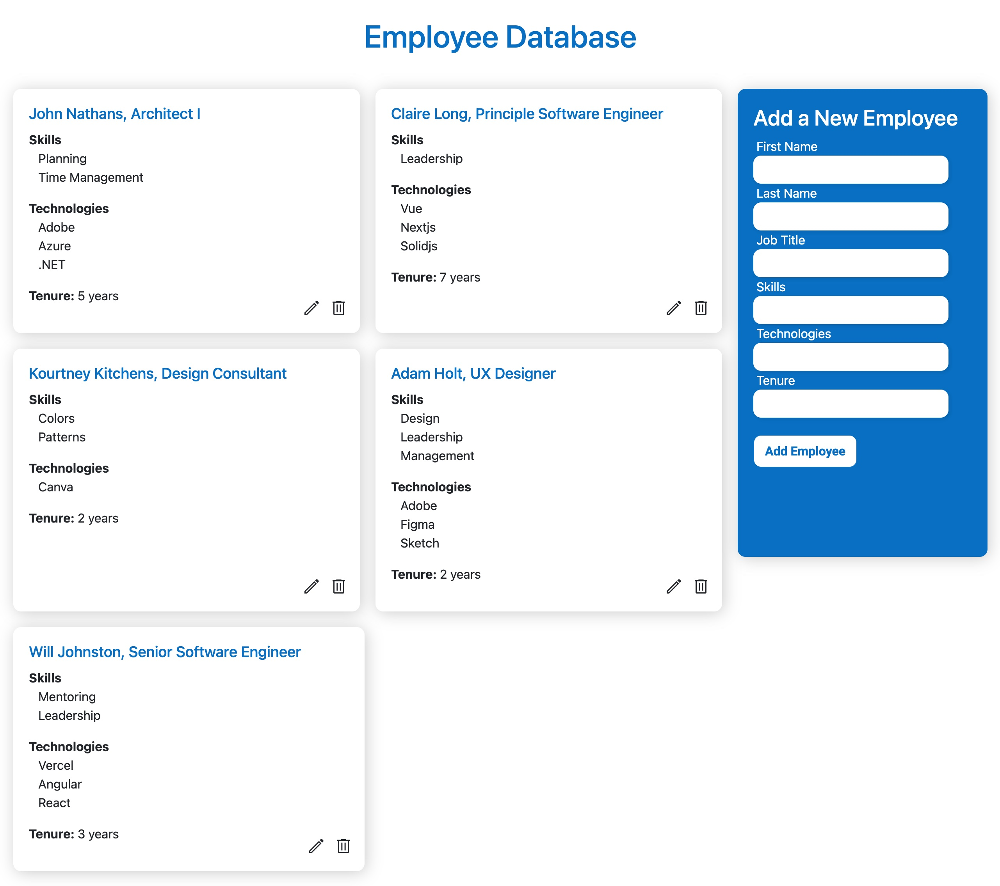

# Employee Management System

This is a full-stack MERN (MongoDB, Express, React, Node.js) application for managing employee information. The application provides a user-friendly interface for adding, editing, deleting and viewing employee records, which are stored in a MongoDB database. The front-end of the application is built using React, which communicates with a back-end API built using Node.js and Express.

## Installation

To install the application, follow these steps:

1. Clone this repository to your local machine using `git clone https://github.com/mathiuskitchens/mern-Employees.git`
2. Navigate to the root directory of the application using `cd mern_Employees`
3. Install the dependencies by running `npm install` in the root directory
4. Navigate to the `backend` directory using `cd backend`
5. Install the backend dev dependencies by running `npm install` in the `backend` directory

## Usage

To use the application, follow these steps:

1. Start the API server by running `npm run dev` in the `backend` directory of the application
2. Start the React app by running `npm run start` in the `frontend` directory
3. Open your web browser and navigate to `http://localhost:3000`

## Features

The application provides the following features:

1. Add new employee record
2. Edit existing employee record
3. Delete employee record
4. View list of all employee records

## API Endpoints

The back-end API provides the following endpoints:

| Endpoint | HTTP Method | Description |
| --- | --- | --- |
| `/api/employees` | GET | Get a list of all employees |
| `/api/employees/:id` | GET | Get a single employee by ID |
| `/api/employees` | POST | Create a new employee |
| `/api/employees/:id` | PATCH | Update an existing employee |
| `/api/employees/:id` | DELETE | Delete an employee |

## Technologies

The application uses the following technologies:

- MongoDB: A NoSQL document-based database used to store employee records
- Express: A web application framework for Node.js used to build the back-end API
- React: A JavaScript library used to build the front-end user interface
- Node.js: A JavaScript runtime used to build the back-end API and serve the React app

## License

This project is licensed under the MIT license. See the [LICENSE](LICENSE) file for details.
